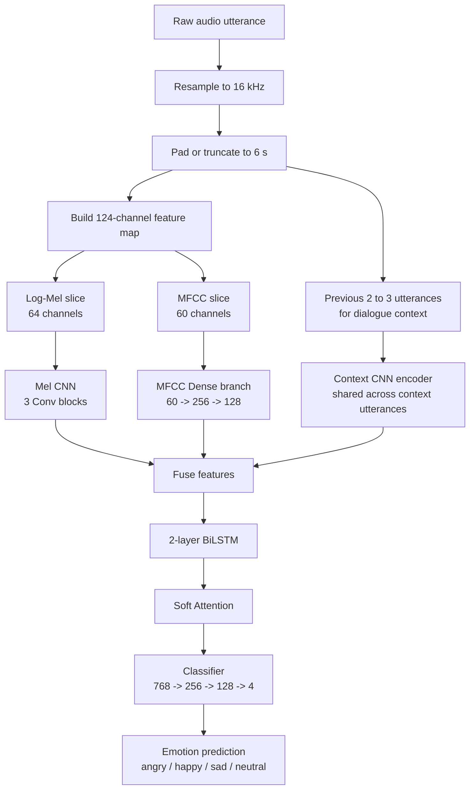

# Speech Emotion Recognition with Dialogue Context

## What we are trying to do
Speech Emotion Recognition (SER) aims to identify emotions such as **angry, happy, sad, and neutral** from spoken audio. In this project, the goal is not only to classify emotions from a single utterance, but also to capture how emotion changes across a conversation while still keeping the system lightweight enough for real-time use.

## Why this is hard
- Emotions are not expressed the same way by different speakers.
- Speech clips have variable lengths and noisy acoustic conditions.
- Emotion datasets are usually imbalanced, so minority classes like **neutral** are harder to learn.
- Many strong transformer models rely on heavy pretraining and are not ideal for efficient real-time deployment.

## How we approached it
We designed a lightweight multi-branch architecture that combines:
- **Log-Mel Spectrogram features** for rich time-frequency patterns
- **MFCC features** for compact speech characteristics
- **Dialogue context** from previous utterances to model emotional continuity

This lets the model capture both **acoustic content inside the current utterance** and **context from surrounding conversation turns**.

## Datasets used
### IEMOCAP
Used as the **main dataset** for training and evaluating the core SER model.
- 12-hour dyadic conversational speech corpus
- 10 speakers
- 4-class setup: **angry, happy, sad, neutral**
- Reported split in the paper: **2,831 train / 354 validation / 354 test**

### MELD
Used in **Model v3** to test cross-domain robustness and conversational context under noisier conditions.
- 13,708 utterances from multi-party dialogues
- 7 original emotion classes
- Mapped into the same 4-class label space for combined training
- Expanded Model v3 training set to **11,076 samples**

## Data preprocessing and features
Each audio clip is:
1. resampled to **16 kHz**
2. padded or truncated to **6 seconds**
3. converted into a feature map of shape **(1, 124, 376)**

The 124 channels are built from:
- **64 Log-Mel bands**
- **60 MFCC-based channels** = 20 MFCCs + delta + delta-delta

These two feature types are standardized and concatenated so the model gets complementary spectral and temporal information.

## Clean architecture diagram

## What each branch does
### 1. Mel CNN branch
Takes the Log-Mel spectrogram and learns spatial time-frequency emotion patterns using a 2D CNN.

### 2. MFCC branch
Processes MFCC features with dense layers to capture compact cepstral cues related to speech emotion.

### 3. Context encoder branch
Encodes the previous **2–3 utterances** so the model can use dialogue history and track emotional continuity rather than treating each clip as fully isolated.

## Training strategy
To improve robustness and class balance, the model uses:
- **Focal Loss** + **label-smoothed soft cross-entropy**
- **AdamW** optimizer
- **CosineAnnealingWarmRestarts** scheduler
- **early stopping on Macro-F1**
- **gradient clipping**
- augmentation with **time masking, frequency masking, and Gaussian noise**

### Model v3 additions
Model v3 extends the base model with:
- **InstanceNorm2d** for speaker normalization
- **Mixup** augmentation
- longer dialogue context (**3 previous utterances**)
- combined **IEMOCAP + MELD** training

## What we achieved
### Main result on IEMOCAP
- **Accuracy:** 55.9%
- **Macro-F1:** 52.4%
- **UAR:** 51.9%
- **RTF:** 0.00008

### Comparison to baselines
- **MFCC + MLP baseline:** 40.1% accuracy
- **Transformer from scratch baseline:** 45.5% accuracy
- **Our model:** 55.9% accuracy

### Key takeaway
The proposed architecture outperformed both baselines while staying extremely fast, making it suitable for **real-time speech emotion recognition**.

## Why the model helps
This design addresses the main project challenges by:
- combining **two complementary acoustic views** of the same utterance
- adding **dialogue context** instead of treating speech as a static image
- using **imbalance-aware training** to improve minority-class behavior
- remaining lightweight enough for **real-time deployment**

## In one sentence
We built a **lightweight, context-aware speech emotion recognition system** that combines **Log-Mel, MFCC, and dialogue history** to improve accuracy while staying fast enough for real-time use.
